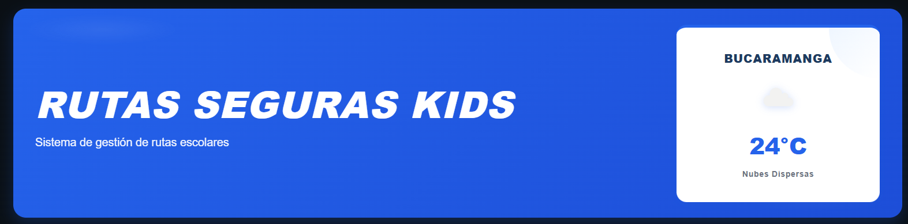
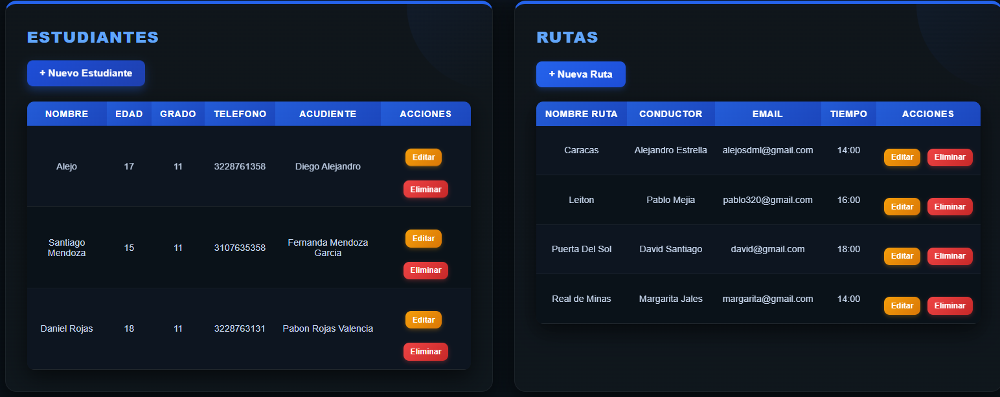
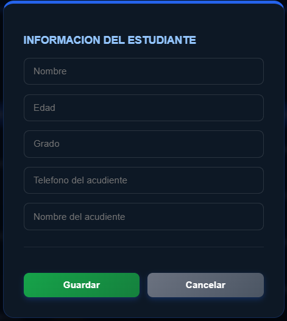
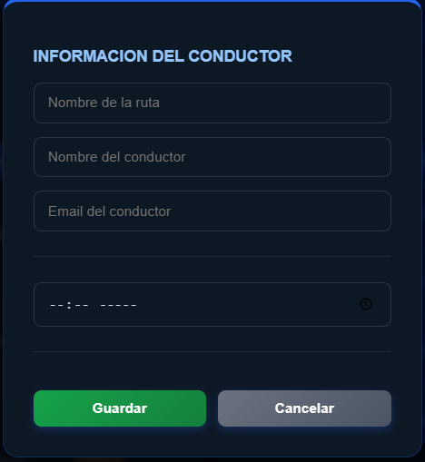
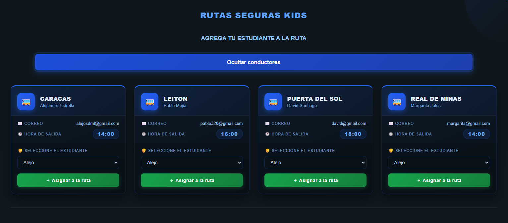
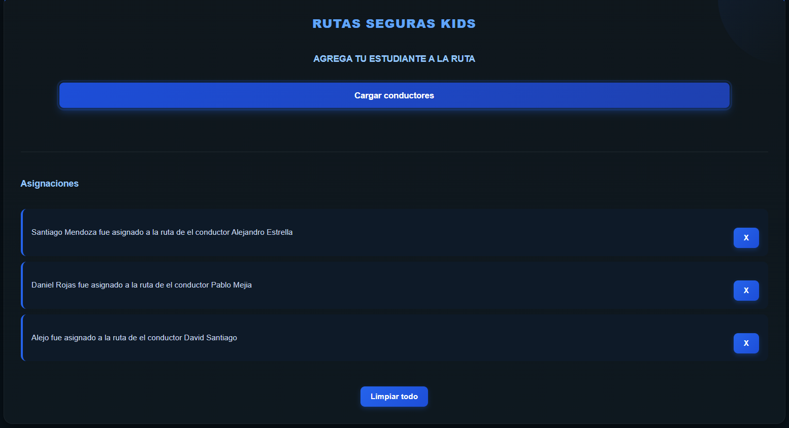
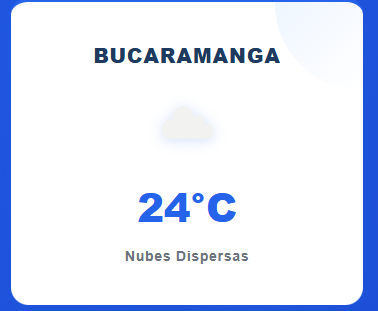

# 🚍 Rutas Seguras Kids

Sistema frontend desarrollado para la empresa **Rutas Seguras Kids**, enfocado en la gestión de rutas escolares y asignación de estudiantes a conductores.  
El proyecto fue construido únicamente con **HTML, CSS y JavaScript**, sin frameworks ni librerías externas, demostrando manipulación dinámica del DOM, uso de eventos, consumo de APIs públicas y creación de Web Components.

---

# 📌 Objetivo del proyecto

El sistema permite administrar estudiantes, rutas escolares y asignaciones de transporte de manera visual e interactiva. Además, integra información climática en tiempo real mediante una API pública para mejorar la experiencia del usuario.

---

# ✨ Funcionalidades principales

✅ Registro dinámico de estudiantes.  
✅ Creación y administración de rutas escolares.  
✅ Asignación de estudiantes a conductores.  
✅ Edición y eliminación de datos en tiempo real.  
✅ Persistencia de información con LocalStorage.  
✅ Consumo de API pública (OpenWeather).  
✅ Uso de Web Components y Shadow DOM.  
✅ Diseño responsive con múltiples breakpoints.  
✅ Validaciones de formularios.  
✅ Interfaz moderna e interactiva.

---

# 🛠️ Tecnologías utilizadas

| Tecnología | Uso |
|---|---|
| HTML5 | Estructura de la aplicación |
| CSS3 | Diseño responsive y estilos |
| JavaScript  | Lógica e interactividad |
| LocalStorage | Persistencia de datos |
| OpenWeather API | Información del clima |
| Web Components | Componentes reutilizables |

---

# 📂 Estructura del proyecto

```bash
📁 RutasSegurasKids
│
├── index.html
├── styles.css
├── solicitudes.js
├── README.md
│
└── 📁 img
    ├── inicio.png
    ├── estudiante-nuevo.png
    ├── lista-estudiantes-rutas.png
    ├── ocultar-rutas.png
    ├── ruta-nueva.png
    ├── ruta-seguras.png
    
```

---

# ⚙️ Cómo ejecutar el proyecto

## 1️⃣ Clonar el repositorio

```bash
git clone https://github.com/AlejoSDM/RUTAS-SEGURAS-KIDS.git
```

---

## 2️⃣ Entrar a la carpeta del proyecto

```bash
cd RUTAS-SEGURAS-KIDS
```

---

## 3️⃣ Abrir el proyecto

Simplemente abre el archivo:

```bash
index.html
```

en tu navegador favorito.

---

# 🧠 Explicación del funcionamiento del sistema

---

# 🏠 Página principal

Al iniciar el sistema se muestra un panel principal dividido en secciones para gestionar estudiantes, rutas y asignaciones.

```md

```

### En esta vista encontramos:

- Encabezado principal del sistema.
- Tarjeta del clima usando API de OpenWeather.

---

# 👦 Gestión de estudiantes

El sistema permite agregar estudiantes mediante un formulario dinámico.

```md



```

## Funcionalidades:

- Registrar estudiantes.
- Editar información.
- Eliminar estudiantes.
- Validaciones automáticas:
  - Solo letras en nombres.
  - Edad válida.
  - Teléfono de 10 dígitos.

## Datos registrados:

- Nombre
- Edad
- Grado
- Teléfono
- Acudiente

---

# 🚌 Gestión de rutas escolares

Las rutas escolares pueden crearse dinámicamente desde la interfaz.

```md



```

## Información registrada:

- Nombre de la ruta.
- Nombre del conductor.
- Correo electrónico.
- Hora de salida.

## Funciones disponibles:

- Crear rutas.
- Editar rutas.
- Eliminar rutas.
- Mostrar información en tablas dinámicas.

---

# 👨‍✈️ Tarjetas de conductores

El sistema genera automáticamente tarjetas dinámicas de conductores usando renderizado con JavaScript.

```md

```

## Características:

- Diseño responsive.
- Información visual del conductor.
- Selección de estudiantes mediante `<select>`.
- Botón de asignación dinámica.

---

# 📋 Asignación de estudiantes

Los estudiantes pueden ser asignados a rutas específicas.

```md

```

## El sistema permite:

- Asignar estudiantes a conductores.
- Evitar duplicados de asignación.
- Eliminar asignaciones.
- Limpiar todas las asignaciones.

---

# 🌦️ API del clima

El proyecto consume la API pública de OpenWeather utilizando `fetch` y `async/await`.

```md

```

## Información mostrada:

- Ciudad.
- Temperatura actual.
- Descripción del clima.
- Ícono dinámico del clima.

---

# 🧩 Web Components y Shadow DOM

El sistema implementa un componente personalizado:

```html
<weather-card></weather-card>
```

## Características implementadas:

✅ Shadow DOM.  
✅ Custom Elements.  
✅ Templates dinámicos.  
✅ Encapsulamiento de estilos.  
✅ Reutilización del componente.

---

# 📱 Responsive Design

El proyecto cuenta con diseño adaptable para diferentes dispositivos:

## Breakpoints implementados

```css
@media (max-width: 1024px)
@media (max-width: 480px)
@media (max-width: 430px)
@media (max-width: 393px)
```

## Adaptaciones:

- Tablas con scroll horizontal.
- Cards responsivas.
- Ajuste automático de grids.
- Optimización para móviles.

---

# 🔥 Manipulación del DOM

El proyecto utiliza JavaScript Vanilla para:

- Crear elementos dinámicamente.
- Actualizar tablas en tiempo real.
- Abrir y cerrar modales.
- Escuchar eventos.
- Renderizar listas dinámicas.
- Actualizar contenido sin recargar la página.

---

# 💾 Persistencia de datos

La información se almacena utilizando:

```javascript
localStorage
```

Esto permite mantener:

- Estudiantes registrados.
- Rutas creadas.
- Asignaciones realizadas.

Aunque el navegador sea recargado.

---

# 📌 Conceptos aplicados

## JavaScript

- Arrays
- Objetos
- Eventos
- CustomEvent
- Async/Await
- Fetch API
- DOM
- LocalStorage
- Web Components
- Shadow DOM

## CSS

- Flexbox
- Grid
- Variables CSS
- Media Queries
- Animaciones
- Responsive Design

---

# 🚀 Posibles mejoras futuras

- Integración con backend.
- Base de datos real.
- Sistema de autenticación.
- Panel administrativo.
- Geolocalización de rutas.
- Notificaciones en tiempo real.

---

# 👨‍💻 Autor

Proyecto desarrollado por **Alejandro Solano Durán** como evidencia de aprendizaje y fortalecimiento de habilidades frontend en JavaScript Vanilla.

---

# 📫 Contacto

📧 alejosdml@gmail.com

---

# 📌 Licencia

Proyecto desarrollado con fines educativos y de práctica académica.